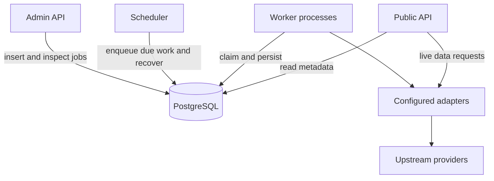
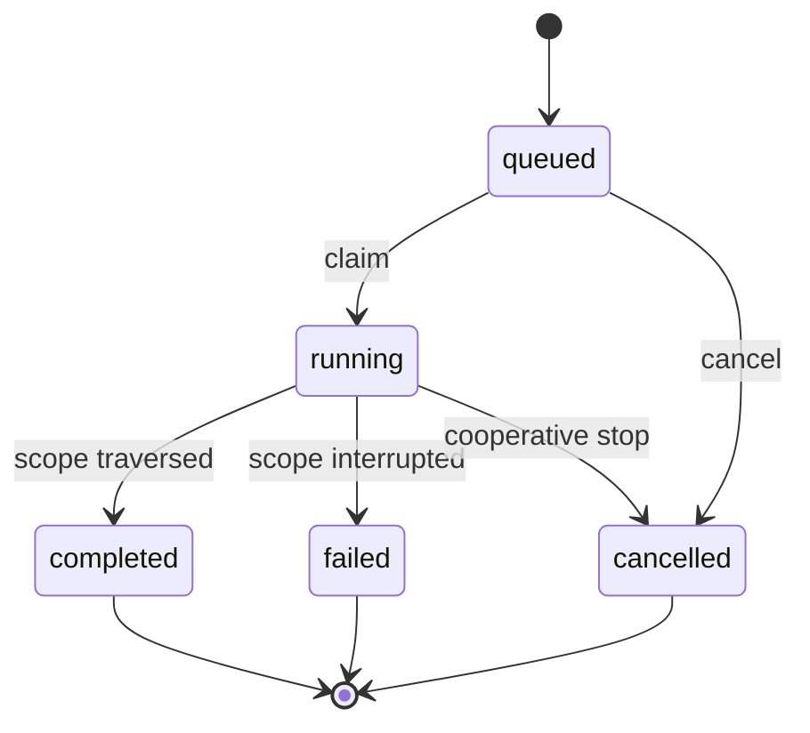

# Nordic Intel — Harvesting and admin implementation plan
Date: 2026-09-05  

This document specifies the metadata harvesting system, its shared library, adapter packages, database integration, and admin control plane. It includes a phased build plan, proposed repository layouts, request/response contracts, and complete reference modules for the queue mechanisms. It is an implementation plan, not a claim that these repositories or a working SCB integration have already been built.

The accepted scope is metadata only. Public data requests still fetch observations from upstream providers. Observation storage, snapshots, historical dataset versions, and a new storage service are not introduced here.


## Contents

1. [Decisions and baseline changes](#1-decisions-and-baseline-changes)
2. [Architecture and ownership](#2-architecture-and-ownership)
3. [Repository and package layouts](#3-repository-and-package-layouts)
4. [Database specification](#4-database-specification)
5. [Adapter contracts and configuration](#5-adapter-contracts-and-configuration)
6. [Harvest lifecycle](#6-harvest-lifecycle)
7. [Scheduling and concurrency](#7-scheduling-and-concurrency)
8. [Cancellation, heartbeat, and recovery](#8-cancellation-heartbeat-and-recovery)
9. [Admin API specification](#9-admin-api-specification)
10. [Metadata persistence and public API integration](#10-metadata-persistence-and-public-api-integration)
11. [Deployment and operations](#11-deployment-and-operations)
12. [Implementation phases and acceptance criteria](#12-implementation-phases-and-acceptance-criteria)
13. [Verification plan](#13-verification-plan)
14. [Reference implementations](#14-reference-implementations)
15. [Research basis and deferred decisions](#15-research-basis-and-deferred-decisions)


## Preface

NordicIntel is a unified HTTP API that acts as a **router/hub** over multiple upstream statistical
data providers (SCB / PxWeb-family endpoints, and more later), exposing them all
through a single interface conforming to the **[PxApi 2.0](https://statistikdatabasen.scb.se/api/v2/swagger/v2/swagger.json)** contract.

- **Stack:** Python + FastAPI + Psycopg
- **Database:** AWS Postgres — **metadata only**, no observations stored until potential future milestones
---

End users query every connected statistical source through one interface, one query
grammar and one identifier space, instead of learning each provider's own API.

In Milestone 1 — and, for the foreseeable future, the router **stores table metadata,
not values/observations**:

- **Stored in Postgres:** table metadata records (dimensions, categories/values, source, periods, update timestamps) and per-provider API connection and configuration info.
- **Not stored:** observations/values.
- **Not in scope for initial implementation:** codelists, saved-queries, default selections, etc..

When a data request arrives, the router parses it, expands the selection against
stored metadata, translates it into the upstream provider's native query, fetches
live from that provider, and returns the result in the requested output format.


## 1. Decisions and baseline changes

### 1.1 Agreed decisions

| Area | Decision |
|---|---|
| Repository split | API, harvest service, shared core library, and one package/repository per adapter family |
| Provider integration | A provider is a configured adapter instance; a new provider using an existing protocol normally needs configuration, not a repository |
| Scheduler | One process; interval schedules are sufficient |
| Workers | One or more processes; one active job per worker initially |
| Queue | PostgreSQL `harvest_job` rows; no Redis, Celery, or separate broker in v1 |
| Job history | The queued row becomes the execution record |
| Item history | Lightweight `harvest_item` rows; not independently queued, claimed, or retried |
| Job statuses | `queued`, `running`, `completed`, `failed`, `cancelled` |
| Item statuses | `running`, `updated`, `skipped`, `failed` |
| Default harvesting | Incremental discovery/comparison, then refresh missing, changed, or failed metadata |
| Force option | Refresh every table/language within the requested scope, bypassing unchanged checks |
| Languages | Optional list on a job, interpreted by the adapter; omitted means configured defaults |
| Database writes | API and workers use Psycopg directly through core database helpers and parameterized `.sql` files; no ORM |
| Admin control | API queues work and exposes schedules, queues, execution history, items, and cancellation |
| Cancellation | Cooperative; preserve successfully committed metadata |
| Heartbeat | Job-level timestamp; independent of individual upstream requests |
| Recovery | Automatically detect and close abandoned jobs; no immediate automatic retry |
| Retry | Next ordinary scheduled run or a new manual job; no parent-run or attempt hierarchy |
| Secrets | Deployment environment/secrets; database contains references only |
| Migrations | One Alembic history and versioned SQL files in core; a standalone migration task runs once, independently of API/worker startup |

`parent_run_id`, job-level `harvester_type`, and job-level `harvester_version` are omitted. Adapter versions are pinned in dependency locks and recorded in deployment/startup logs. A provider stores its adapter name, not a copy of every package version on every job.

### 1.2 Proposed defaults, not additional product requirements

| Setting | Initial suggestion | Reason |
|---|---|---|
| Schedule interval | 86,400 seconds for the first provider | Daily metadata refresh; configurable per provider |
| Scheduler polling | 15 seconds | Adequate for interval scheduling |
| Empty-queue polling | 2 seconds | Responsive manual triggers without tight polling |
| Heartbeat interval | 30 seconds | Small database load |
| Cancellation polling | 2 seconds | Separate reads between heartbeat writes |
| Stale threshold | 180 seconds | Tolerates several delayed heartbeats |
| Concurrent jobs | 1 per worker, 1 per provider globally | Simple isolation and serialization |
| Item processing | Sequential within a provider initially | Predictable rate limiting and cancellation |
| Upstream request timeout | 30 seconds, adapter-configurable | Bounds cancellation delay during network calls |
| HTTP 429 retry budget | Up to 120 seconds per operation | Backoff is an upstream retry, not a new harvest job |
| Admin pagination | Default 50, maximum 200 | Bounded reads |
| History cleanup | No automatic deletion initially | Avoid silently losing diagnostic history or idempotency keys |

These are configuration values to validate against the first full SCB harvest. They are not measured capacity promises.

### 1.3 Explicit amendments to `specs.md`

| Baseline statement | Replacement/clarification |
|---|---|
| One harvester package per provider | One package per adapter family; providers supply configuration |
| ORM models and migrations live in API | Remove ORM mappings; core owns typed Python models, SQL table definitions, queries and Alembic history; a standalone migration task applies changes |
| Worker is the single metadata writer | Worker owns harvested fields; API owns operator fields; both use shared persistence rules |
| Provider adapter version records the producing release | Adapter identity is configuration; release provenance is deployment/log information initially |
| Mark unseen tables discontinued | Only after a successful, authoritative, provider-wide discovery; never after an incomplete or language-restricted traversal |
| Reharvest is asynchronous | Retained, with explicit job/item read endpoints, options, cancellation, and recovery |

The baseline public contract remains: stable canonical slugs and aliases; preserved category order; local selection expansion; preflight limits; live upstream observation retrieval; JSON-stat2/CSV; disabled versus operator-disabled versus discontinued; PostgreSQL search. This plan does not claim to resolve the missing `pxapi2.json` contents, expression grammar, or measured latency targets.

## 2. Architecture and ownership



The diagram shows runtime responsibilities. Core is an imported Python package, not an additional network service. Adapter packages may expose both harvesting and live-data capabilities, but the API never launches the harvest engine on a public request.

### 2.1 Ownership matrix

| Concern | Owner | Consumers |
|---|---|---|
| Shared typed data models | Core `models` package | API, harvest, adapters |
| HTTP client, retries and rate-limit utilities | Core `http` package | API, harvest and adapters |
| SQL definitions, queries and reusable database functions | Core `database` package | API and harvest |
| Database migrations | Core repository | Standalone migration task using a selected core release |
| Provider configuration API and validation | API using adapter configuration models | Admin clients |
| Schedule configuration | API writes, scheduler reads/advances | Admin clients and scheduler |
| Job admission/cancellation | API | Workers |
| Claiming, heartbeat, lifecycle | Harvest service using core queue helpers | Workers and scheduler |
| Upstream discovery and stamp interpretation | Adapter | Harvest engine |
| Per-table persistence | Core repositories invoked by worker | Public metadata readers |
| Operator availability flags | API | Worker must preserve them |
| HTTP request translation and response normalization | Adapter | Public API and/or harvest engine |
| Local selection expansion | Shared API/core logic | Public API; never delegated upstream |

Workers receive separate DB credentials from the API. They need access to metadata and harvesting tables, not migration privileges. The adapter itself receives typed context and HTTP access, not an unrestricted database session.

### 2.2 Why direct database access

This is a first-party system with one shared metadata store. Direct access permits atomic metadata/stamp writes, efficient reads for comparison, and short per-table transactions without depending on API availability. The reusable boundary is a core repository function, not a required HTTP hop.

A future authenticated metadata import endpoint can reuse the same validation and persistence functions. It is deferred until another producer needs it. If introduced, it must obey provider serialization and field ownership; importing core alone does not prevent competing writers.

## 3. Repository and package layouts

The paths below are suggested files to implement. They are not an inventory of existing repositories. Python packages use `src/` layout and explicit package boundaries; tests mirror behavior rather than every function.

### 3.1 `nordicintel-core`

Use `models`, `database`, and `http` as the main package names. `models` means ordinary typed Python/Pydantic data structures and validation, not ORM mappings. There is no separate `contracts` or `persistence` package.

| Path | Responsibility |
|---|---|
| `pyproject.toml` | Package data includes SQL files; optional `db` (Psycopg), `http`, and `migrations` (Alembic, SQLAlchemy, Psycopg) dependencies |
| `src/nordicintel_core/__init__.py` | Small export surface; no automatic startup work |
| `src/nordicintel_core/models/provider.py` | Provider descriptors and initialization configuration |
| `src/nordicintel_core/models/harvest.py` | Job options, discovery entries, item results and errors |
| `src/nordicintel_core/models/metadata.py` | Validated multilingual table/dimension/category data |
| `src/nordicintel_core/models/adapters.py` | Shared harvesting and live-data interfaces |
| `src/nordicintel_core/settings.py` | Shared configuration models and explicitly called loading helpers |
| `src/nordicintel_core/errors.py` | Shared typed errors |
| `src/nordicintel_core/database/connection.py` | Psycopg connections and transaction helpers |
| `src/nordicintel_core/database/sql_files.py` | Read packaged UTF-8 SQL resources |
| `src/nordicintel_core/database/providers.py` | Provider database operations |
| `src/nordicintel_core/database/tables.py` | Metadata reads/upserts preserving operator fields and IDs |
| `src/nordicintel_core/database/jobs.py` | Job admission, item operations, reads and cancellation |
| `src/nordicintel_core/database/locking.py` | Provider lock convention and ownership helpers |
| `src/nordicintel_core/database/sql/queries/` | Parameterized SQL queries; package with `__init__.py` and SQL resources |
| `src/nordicintel_core/database/sql/migrations/0001_initial.up.sql` | Initial table/index definitions, immutable once deployed |
| `src/nordicintel_core/database/sql/migrations/0001_initial.down.sql` | Explicit reverse migration where safe |
| `src/nordicintel_core/database/sql/migrations/0002_add_heartbeat.up.sql` | Illustrative later ALTER migration; do not add it if heartbeat is already in the initial schema |
| `src/nordicintel_core/http/client.py` | Shared HTTP request handling and client lifecycle interface |
| `src/nordicintel_core/http/retry.py` | Retry/backoff utilities |
| `src/nordicintel_core/http/rate_limit.py` | Shared rate-limiter implementation |
| `alembic.ini`, `alembic/env.py` | Core-owned migration configuration using SQLAlchemy with the Psycopg driver |
| `alembic/versions/` | Revision IDs/dependencies; upgrade/downgrade load matching immutable SQL files |
| `tests/models/`, `tests/database/`, `tests/http/` | Model validation, actual PostgreSQL behavior and HTTP utility checks |

Core contains shared models, database operations, HTTP utilities, and configuration helpers. Applications initialize these components explicitly and own their lifecycle. Framework-specific routes remain in the API; provider-specific URLs, parsing and protocol behavior remain in adapters. Shared response models are welcome where used by multiple consumers. Avoid automatic environment reads and global client creation on import; explicit settings-loading helpers are fine.

API and workers each initialize a core HTTP client and pass it to adapters. Shared rate-limiter code does not share in-memory rate-limit state across processes; combined upstream quotas still need coordination. Keep data-model imports usable without importing FastAPI or opening a database connection.

### 3.2 `nordicintel-api`

| Path | Responsibility |
|---|---|
| `pyproject.toml`, `uv.lock` | Pinned service dependencies, core and required adapter wheels |
| `src/nordicintel_api/app.py` | Application factory and route registration |
| `src/nordicintel_api/settings.py` | API settings, DB URL, admin token |
| `src/nordicintel_api/dependencies.py` | Per-request Psycopg connection/transaction and authenticated admin dependencies |
| `src/nordicintel_api/public/` | Tables, providers, config, metadata and live-data routes |
| `src/nordicintel_api/admin/providers.py` | Provider configuration and enable/disable |
| `src/nordicintel_api/admin/schedules.py` | Schedule list/get/upsert |
| `src/nordicintel_api/admin/jobs.py` | Trigger, list/get jobs, item reads, cancellation |
| `src/nordicintel_api/admin/tables.py` | Operator flags and single-table refresh alias |
| `src/nordicintel_api/admin/schemas.py` | Explicit public admin request/response models |
| `src/nordicintel_api/services/selection.py` | Local expression expansion and preflight validation |
| `src/nordicintel_api/services/data.py` | Live adapter dispatch and supported output rendering |
| `src/nordicintel_api/services/adapters.py` | Installed adapter registry and configuration validation |
| `tests/admin/`, `tests/public/`, `tests/postgres/` | API contracts and integration tests |
| `scripts/gate.py` | Existing baseline's differential acceptance gate |
| `Dockerfile` | API image |
| `deploy/compose.yaml` | API, scheduler, workers using explicit image versions and external DB |
| `docs/admin-api.md`, `docs/operations.md` | Generated/maintained API and operational instructions |

The API has no catalogue traversal loop, heartbeat loop, or background scheduler. Its startup does not run Alembic.

### 3.3 `nordicintel-harvest`

| Path | Responsibility |
|---|---|
| `pyproject.toml`, `uv.lock` | Core, installed adapters, HTTP client and process dependencies |
| `src/nordicintel_harvest/settings.py` | Poll intervals, heartbeat, request and shutdown limits |
| `src/nordicintel_harvest/scheduler.py` | Recovery followed by interval enqueueing |
| `src/nordicintel_harvest/worker.py` | Claim one job, run it, release lock, repeat |
| `src/nordicintel_harvest/engine.py` | Discovery, comparison, per-table processing, retirement |
| `src/nordicintel_harvest/heartbeat.py` | Independent heartbeat and cancellation monitoring |
| `src/nordicintel_harvest/recovery.py` | Stale-job scan and lock-protected failure finalization |
| `src/nordicintel_harvest/registry.py` | Explicit installed adapter-name-to-factory map |
| `src/nordicintel_harvest/clients.py` | Initialize core HTTP utilities with worker configuration and manage their lifetime |
| `src/nordicintel_harvest/logging.py` | JSON logs, IDs and secret redaction |
| `tests/postgres/` | Concurrent claim, cancellation, recovery and scheduler tests |
| `tests/lifecycle/` | Recorded first-adapter behavior, incremental and language cases |
| `Dockerfile` | One image with distinct scheduler and worker commands |
| `docs/runbook.md` | Stalled jobs, failures, forced refreshes, graceful shutdown |

`worker.py` is process orchestration. `engine.py` implements the real harvest. Neither exposes a separate HTTP admin server. Put reusable SQL operations in core as they stabilize; avoid parallel implementations in API and harvest.

### 3.4 `nordicintel-adapter-pxweb`

| Path | Responsibility |
|---|---|
| `pyproject.toml` | Adapter package and supported core range |
| `src/nordicintel_adapter_pxweb/config.py` | Typed, extra-fields-forbidden initialization configuration |
| `src/nordicintel_adapter_pxweb/adapter.py` | Public adapter factory and capability dispatch |
| `src/nordicintel_adapter_pxweb/discovery.py` | Catalogue traversal and authoritative coverage reporting |
| `src/nordicintel_adapter_pxweb/changes.py` | Adapter-owned comparison of stamps/hashes/metadata |
| `src/nordicintel_adapter_pxweb/metadata.py` | Metadata fetch and normalized output |
| `src/nordicintel_adapter_pxweb/data.py` | Live upstream data requests and status preservation |
| `src/nordicintel_adapter_pxweb/normalize.py` | Shared protocol normalization helpers |
| `tests/fixtures/` | Recorded SCB responses, including Swedish text |
| `tests/` | Configuration, discovery, language, metadata and live-data behavior |
| `examples/providers/scb.json` | Non-sensitive example configuration only |
| `README.md` | Configuration fields, language support, marker reliability, known limitations |

Do not pretend all PxWeb generations have identical endpoints. Add protocol-specific modules when the first real integration needs them; a provider config identifies the supported protocol explicitly. SDMX is a future adapter package, not an extra provider required for the first milestone.

### 3.5 Package release rules

1. Publish core data models, database helpers and matching SQL migrations first.
2. Build adapter packages against compatible core versions.
3. Pin tested core and adapter versions in API and harvest lockfiles.
4. Apply additive migrations once using the selected core release, independently of API/worker startup.
5. Deploy compatible API/worker images, recording image digests and package versions.
6. Remove old schema fields only after all consumers stop using them.

The core library does not auto-install adapters. The database selects from an allowlisted registry compiled into each image. Configuration changes are read when a job starts; a running job uses its initialized configuration. Capture non-sensitive effective configuration in structured job-start logs rather than adding a full configuration history table.

### 3.6 SQL files and standalone migrations

Use Psycopg directly for application queries. Alembic tracks migration revisions and executes their SQL through SQLAlchemy's connection layer with Psycopg underneath (`postgresql+psycopg://`). No ORM models or model-derived table definitions are required anywhere. Configure Alembic with `target_metadata=None`; revisions are authored explicitly rather than autogenerated from ORM changes. [Alembic SQL execution](https://alembic.sqlalchemy.org/en/latest/ops.html#alembic.operations.Operations.execute)

Table, index, constraint, view and PostgreSQL function definitions live in versioned `.sql` migration files in core. Normal SELECT/INSERT/UPDATE queries live in the separate `sql/queries/` package. Actual PostgreSQL `CREATE FUNCTION` definitions are optional: use them when a server-side shared operation is useful, not merely because a query is predefined.

Once deployed, do not edit an old migration to change an existing database. Add a new revision and SQL change, such as `ALTER TABLE`. An optional complete `schema.sql` is generated for inspection; the ordered migrations remain authoritative. A migration must load its own fixed SQL resource, never the latest mutable application query file. Do not split scripts by semicolons: function bodies can contain them. Test the chosen driver execution path on the actual scripts, including casts, bind-like text and function bodies.

A migration task checks out or installs the selected core release **including its Alembic configuration and SQL assets**, then runs from the core checkout:

```bash
alembic -c alembic.ini upgrade head
```

The environment supplies the migration database credentials. The API and worker can both be stopped; this command starts neither. Only one deployment task runs it against a database at a time. The complete migration payload must ship with the migration artifact; API and worker images need only their runtime core extras and query resources. Include SQL resources explicitly in wheel packaging and verify them from an installed wheel, not only from a source checkout.

SQLAlchemy is a migration dependency, not an API/worker database abstraction. Keep schema changes and matching typed models/database helpers in the same core commit/release. Deploy additive schema changes before consumers that require them.

## 4. Database specification

### 4.1 Existing metadata tables

Retain provider, table registry, aliases, dimensions, categories and search representation from the baseline. Use `"table"` in the reference SQL only to match the existing specification; a less awkward SQL name can be chosen before the first migration.

The multilingual physical layout needs a language-keyed metadata component. Suggested key: `(table_id, language)` for labels, notes, description, metadata fetch timestamp, and adapter-owned comparison state. Dimensions/categories must retain their language-associated ordering and labels. Shared upstream identity remains one table row. Do not split one source table into different canonical table IDs merely because it has two languages.

This plan defines the harvest schema fully. The complete public metadata DDL must be derived from the supplied public contract during Phase 1; the missing `pxapi2.json` must not be reconstructed from guesses.

### 4.2 Provider operational configuration

| Field | Meaning |
|---|---|
| `id` | Existing provider identity |
| `adapter_type` | Allowlisted installed adapter name |
| `config` JSONB | Non-sensitive adapter initialization values, including endpoint and defaults |
| `secret_refs` JSONB | Logical credential name → environment variable name |
| `enabled` | Admission and serving kill switch |
| Existing public fields | Label, description, website, region; explicit public projection |

Prefer a single canonical location for each setting. If migrating existing `base_url`/`rate_limit` columns into `config`, perform an explicit migration and update both consumers; do not retain two competing settings indefinitely. Raw credentials never appear in config, responses, jobs, or item errors.

### 4.3 Harvest schedule

One optional schedule row per provider. Absence means manual-only.

| Field | Type | Rule |
|---|---|---|
| `provider_id` | text PK/FK | One schedule per provider |
| `enabled` | boolean | Pause schedule without disabling provider |
| `every_seconds` | positive integer | Elapsed interval, not wall-clock cron |
| `next_run_at` | timestamptz | Due time in UTC |
| `request` | JSONB | Normalized job options; schedule always provider-wide |

Schedules may carry language preferences and `force`, although ordinary schedules should use `force=false`. Pausing a schedule does not cancel already queued/running jobs. Re-enabling an overdue schedule makes it eligible once; it does not enqueue every missed interval.

### 4.4 Harvest job

| Field | Type | Rule |
|---|---|---|
| `id` | bigint identity PK | Shared queue/history ID |
| `provider_id` | FK | Required |
| `request` | JSONB | Exactly `table_id`, `force`, `languages` after normalization |
| `trigger` | text | `manual` or `schedule`; useful source of work, not a lifecycle state |
| `request_key` | nullable unique text | Optional idempotency key, max 200 characters |
| `status` | checked text | Five agreed statuses |
| `cancel_requested` | boolean | Only meaningful while running |
| `created_at` | timestamptz | Enqueued |
| `started_at` | nullable timestamptz | Claim committed |
| `heartbeat_at` | nullable timestamptz | Initialized with claim, updated while running |
| `finished_at` | nullable timestamptz | Terminal status |
| `error` | nullable JSONB object | Job-level error; not a copy of every item error |

Counters are derived from items initially. Do not independently increment counters that can drift after crashes. No worker identity, parent job, attempt number, harvester version, priority queue, or lease token is required for this design.

### 4.5 Harvest item

| Field | Type | Rule |
|---|---|---|
| `id` | bigint identity PK | Internal item record |
| `job_id` | FK | Owning execution |
| `source_table_id` | text | Known even if normalization/import fails |
| `table_id` | nullable FK | Canonical internal table if established |
| `status` | checked text | `running`, `updated`, `skipped`, `failed` |
| `started_at` | timestamptz | Item begins processing |
| `finished_at` | nullable timestamptz | Item reaches outcome |
| `error` | nullable JSONB object | Structured diagnostics, including language-specific failures |

Unique `(job_id, source_table_id)` prevents duplicate catalogue entries generating duplicate items. Deduplicate discovery IDs before processing. There is one item per source table in a job, not one item per HTTP request or language.

Example multilingual error:

```json
{
  "code": "language_refresh_failed",
  "message": "One requested language could not be refreshed.",
  "successful_languages": ["en"],
  "failures": [
    {"language": "sv", "stage": "fetch_metadata", "code": "upstream_timeout"}
  ]
}
```

Error stages: `discovery`, `fetch_metadata`, `normalize`, `persist`, `interrupted`. Codes are extensible diagnostic strings, not another status enumeration. Cap payload size (suggested 16 KiB), omit credentials and response bodies, and keep stack traces in appropriately redacted logs. Unknown tables can be diagnosed from `source_table_id`; don't fabricate a valid metadata row merely to satisfy the FK.

### 4.6 Status semantics



`completed` means the planned traversal finished; item failures may still exist. `failed` means the job could not finish its scope, including process interruption, configuration failure, or incomplete discovery. `cancelled` means cancellation was observed and execution stopped. Terminal job rows do not return to queued; a retry inserts a new job.

An item is `updated` when at least one selected language was persisted and all selected languages succeeded or were unchanged. It is `skipped` when all selected languages were unchanged. Any selected-language failure makes the item `failed`, even if another language succeeded. It is not marked failed merely because the job was cancelled after that item completed.

### 4.7 Indexes and consistency

- Queue index: `(created_at, id) WHERE status='queued'`.
- Unique partial index: one `running` job per provider; defense in depth alongside advisory locking.
- Provider history: `(provider_id, created_at DESC, id DESC)`.
- Stale scan: `heartbeat_at WHERE status='running'`.
- Items: `(job_id, status, id)` and `(table_id, started_at DESC)` for diagnostic reads.
- Schedule due index: `next_run_at WHERE enabled`.

A unique running-job index does not detect crashes; a stale row will keep blocking that provider until recovery. A session lock does not update statuses automatically. Both facts are addressed explicitly by the recovery loop.

## 5. Adapter contracts and configuration

### 5.1 Initialization

The core registry resolves `adapter_type`; the adapter parses `config` using its own typed model. The host resolves only declared secret names from deployment variables. Missing required secrets fail initialization before upstream requests. Non-sensitive config can be edited through the admin API. Secret rotation occurs in the deployment environment; credentials are never written back to PostgreSQL.

Example provider body:

```json
{
  "id": "example-statistics",
  "adapter_type": "pxweb",
  "config": {
    "base_url": "https://statistics.example/api/",
    "protocol": "pxweb-v1",
    "default_languages": ["sv", "en"],
    "request_timeout_seconds": 30,
    "minimum_request_interval_seconds": 1
  },
  "secret_refs": {"api_key": "EXAMPLE_STATISTICS_API_KEY"},
  "enabled": true
}
```

This is an illustrative configuration shape, not a verified SCB URL or rate limit. Actual first-provider values come from the adapter implementation and recorded upstream evidence.

### 5.2 Required adapter operations

| Operation | Input | Output / obligation |
|---|---|---|
| Validate configuration | Config and resolved credentials | Typed initialized adapter or clear configuration error |
| Resolve languages | Optional requested codes, provider defaults | Ordered effective codes or explicit unsupported-language error |
| Discover scope | Optional canonical-table resolution/native ID and effective languages | Source entries plus authoritative coverage information |
| Decide refresh | Discovery entry, stored language state, force flag | Which requested languages require fetch; stamp meaning remains adapter-owned |
| Fetch metadata | Source identity, selected language(s), HTTP context | Normalized metadata with corresponding successful source markers |
| Live data capability | Explicit category selections | Upstream request/response translation, separate from harvest lifecycle |

The adapter does not insert jobs, claim work, issue migrations, or change operator flags. It can optimize multi-language calls internally but must return unambiguous language association.

### 5.3 Discovery and comparison data

A discovery entry carries stable source identity, native fetch parameters/URL as needed, available languages if known, and an optional opaque marker. Opaque means core stores and returns it; core does not assume every adapter uses a timestamp or interprets string ordering the same way.

Stored comparison state is language-scoped where language freshness can differ. It includes last successfully persisted marker and last fetch/check times. Keep this state associated with current metadata, not job history: purging history must not make incremental detection stop working.

Catalogue marker equality only justifies skipping when the adapter knows that marker covers the relevant metadata. A table's publication timestamp may not change when labels are corrected. When no reliable catalogue marker exists, fetch metadata and compare normalized content. That still avoids unnecessary database rewrites even if it cannot avoid the HTTP request.

Do not add universal meaning to arbitrary `source_stamp` keys. Hashing, stamps, and value comparisons belong to the adapter's strategy. A deterministic hash helper appears in the examples; the adapter chooses which values go into it.

### 5.4 Normalized metadata requirements

The concrete core model must represent source identity, canonical registry association, language, label/description/notes/source, time coverage, ordered dimensions, ordered category codes/labels, dimension roles, relevant units/status information, upstream links, and the adapter comparison state. Lists preserve semantic order. Validate duplicate dimensions/categories and invalid role references before persistence.

Use typed Python/Pydantic models for normalized metadata and validation; these are not ORM mappings. Put genuinely shared request/response models in core and API-specific response shapes in the API. Adapters return data models, and public serializers explicitly select safe fields rather than exposing complete database rows. The API must preserve upstream status/missing-value semantics on live data as required by the baseline.

## 6. Harvest lifecycle

### 6.1 Standard provider-wide run

1. Claim the job and retain the provider lock.
2. Initialize heartbeat monitoring, validate provider state/configuration, and resolve effective languages.
3. Discover the catalogue. Prefer accumulating the small identity/marker inventory before mutation so completeness is known; do not accumulate all table metadata in memory.
4. Deduplicate source IDs and establish whether discovery was authoritative for the complete provider.
5. For each source table, check cancellation, create its running item, and load existing comparison state.
6. Ask the adapter which selected languages need refresh. Force, missing metadata, and known failures override unchanged markers.
7. Fetch/normalize one language or a provider-supported group, with bounded timeouts and retry backoff.
8. Persist each complete language representation atomically; update its marker in the same transaction. Preserve successful languages when another fails.
9. Finalize the item, including structured language failures when needed.
10. If authoritative full discovery succeeded and cancellation has not been requested, retire truly unseen tables in a short final transaction.
11. Finalize the job. A fully traversed scope with failed items is completed with a nonzero failed count.

No database transaction remains open during upstream HTTP calls. Item creation, each metadata upsert, and item/job finalization are short transactions. A whole-provider staging area and atomic replacement of the entire catalogue are not required.

### 6.2 Single-table and force behavior

`table_id` is a canonical internal ID accepted by the trigger API. Resolve it to the provider-native ID before calling the adapter. Reject a table belonging to another provider. Single-table jobs never retire unrelated tables.

`force=true` forces a fetch for all selected languages in the requested scope. It does not delete records first, bypass validation/rate limits, override a disabled provider, erase unrequested languages, or clear operator-disabled state. It does not mean “download/store observations.”

### 6.3 Language semantics

| Request | Meaning |
|---|---|
| `languages: null` or omitted | Use adapter/provider defaults at execution time |
| `languages: ["sv"]` | Request Swedish metadata |
| `languages: ["sv", "en"]` | Request both; adapter can batch upstream calls |
| Empty list | Reject as ambiguous |
| Unsupported code | Clear validation/configuration error; no silent substitution |

Normalize duplicate codes and casing at admission for request identity, while adapters map normalized codes to their upstream spelling. Allow language tags beyond two characters. A language with no stored metadata is missing even if the table-wide catalogue marker is unchanged.

If English succeeds and Swedish fails, commit English, retain the old Swedish state, record the Swedish failure, and retry Swedish on a later run. Until a separate per-language public availability policy is agreed, preserve the baseline's conservative table-level disabled behavior: a genuine upstream table failure disables the table; a partial-language success alone does not clear an outstanding failure. Administrative interruption and worker crashes must not mass-disable healthy tables.

### 6.4 Retirement and identities

Retire only if the adapter confirms a complete provider inventory. A language-filtered catalogue can omit real tables, so it is not automatically authoritative. Explicit upstream discontinuation flags can update the corresponding discovered table independently.

If discovery fails halfway, fail the job, retain all known tables, and do not apply absence-based retirement. Cancellation also skips retirement. An authoritative successful empty catalogue can be valid, but the adapter must validate response shape/completeness rather than interpreting any empty/error payload as evidence of removal.

Canonical slugs are minted once and never recomputed from changed titles. Native identifiers are provider-scoped. Renames require upstream identity evidence or an explicit operator mapping; do not infer a rename solely from a similar label. Preserve aliases and prevent collisions with existing canonical IDs. No hard deletion of previously published tables.

### 6.5 Failure classification

| Failure | Action |
|---|---|
| HTTP 429 | Shared-host backoff, respect Retry-After when valid; retry within budget |
| Transient timeout/5xx | Bounded retry; item failure if exhausted |
| Unsupported language/configuration | Fail job before traversal when detectable |
| Bad metadata for one table | Fail item, retain previous valid metadata, follow baseline availability rules |
| Incomplete catalogue | Fail job, no absence-based retirement |
| Database ownership connection lost | Abort execution; never reconnect and resume protected writes |
| Cancellation | Finish/roll back current short transaction, finalize current item as interrupted if necessary, cancel job |
| Unexpected process exit | Recovery later marks abandoned job and running items failed |

Retries must check cancellation between attempts and during backoff. Provider locks serialize jobs, not every host's requests. If two providers share a rate-limited host, either assign them to one worker initially or implement a shared host limiter before enabling parallel requests across them. Public live-data requests may also consume the same upstream quota; an in-process worker limiter alone cannot enforce an account-wide limit across services.

## 7. Scheduling and concurrency

### 7.1 Interval rules

The scheduler runs recovery, then checks due schedules. It enqueues at most one scheduled job for a provider with no queued/running job, and advances `next_run_at` in the same transaction as insertion. The next time is enqueue time plus the configured interval. It is not finish time plus interval and does not promise a fixed clock time.

If an overdue provider is already busy, keep its schedule due and coalesce missed ticks. Once it becomes idle it can receive one new scheduled job. A manual job does not separately advance the schedule. Therefore a long manual run can be followed promptly by the overdue scheduled run; this is an explicit simple policy.

Two different manual requests may queue two jobs; an idempotency key only deduplicates the same logical request. Do not silently merge a forced/language-specific manual request into unrelated existing work.

One scheduler is the supported deployment. A singleton advisory lock prevents two accidentally launched scheduler processes from both acting. Due-row locks provide additional transactional protection. Scheduler restart does not erase due times or queued jobs.

### 7.2 Claim versus execution lock

`FOR UPDATE SKIP LOCKED` is a short transaction mechanism: competing workers skip rows another worker is claiming. The provider advisory lock spans the whole harvest and prevents distinct jobs for one provider from running simultaneously. A partial unique running-job index additionally rejects invalid state transitions. PostgreSQL documents skip-locked reads as appropriate for queue consumers. [PostgreSQL SELECT](https://www.postgresql.org/docs/current/sql-select.html)

Use a dedicated direct PostgreSQL connection for the provider session lock and metadata writes. Commit the claiming transaction before upstream I/O. Do not return that connection to a pool before releasing the lock. Transaction-pooling endpoints are unsuitable for this connection. Session locks survive commits and end on explicit unlock or session termination. [PostgreSQL advisory locks](https://www.postgresql.org/docs/current/explicit-locking.html)

All workers and recovery use exactly the same lock-key convention. The example hashes the namespaced provider ID to a signed 64-bit key; a collision causes conservative serialization, not concurrent access. The deployed convention must remain stable across versions.

### 7.3 Connection ownership

Each active worker uses one dedicated Psycopg owner connection and a separate heartbeat connection. The heartbeat thread never shares the owner connection. API handlers receive their own connection/transaction scope. Explicit SQL files do not change connection ownership: all writes protected by a provider lock use the same owner connection.

API and worker database operations use Psycopg directly; no ORM or SQLAlchemy application session is needed. The reference implementation uses this same approach. Do not wrap the owner connection in a pool that silently reconnects or changes the physical session. SQLAlchemy is retained only as the connection layer used by Alembic, with Psycopg as its PostgreSQL driver.

## 8. Cancellation, heartbeat, and recovery

### 8.1 Cooperative cancellation

Queued cancellation atomically changes queued → cancelled. Running cancellation sets `cancel_requested=true`; the API does not claim execution has stopped. The worker checks between catalogue pages, tables, requests, retry waits, and before persistence/retirement. It then commits or rolls back its current short operation and finalizes the job.

Previously committed metadata remains. A started but unfinished item is failed with an interruption code, not left running. No items are fabricated for undiscovered/unstarted tables. Cancellation is not an immediate process kill and cannot undo upstream requests already sent.

A cancellation racing final completion is resolved by a row lock on the job: if cancellation commits first, finalization sees it and cancels; if completion commits first, the cancel request returns the already-terminal job. A final table transaction can finish while cancellation arrives; the response must not promise zero further writes after the HTTP request.

### 8.2 Heartbeat

Set heartbeat at claim time, then update every 30 seconds from an independent monitoring thread/connection. Use PostgreSQL timestamps rather than worker wall clocks for stored times. A long network request must not suppress the heartbeat. Failure to maintain the heartbeat sets a local stop signal; the engine checks that signal before additional writes.

A live heartbeat means the process can communicate, not that it is making useful progress. A hung adapter can remain alive. Bound upstream timeouts and expose started/finished item times so progress can be investigated.

The reference monitor polls cancellation every two seconds while writing heartbeat every thirty seconds. A checkpoint observes the latest local signal; cancellation latency includes polling delay plus any bounded operation already in progress. There is no claim of instantaneous cancellation.

### 8.3 Automatic recovery policy

1. Find running jobs whose heartbeat is older than 180 seconds.
2. Try the same provider session lock without waiting.
3. If unavailable, expose a stalled warning and leave state unchanged.
4. If acquired, lock and reread the job row; verify it remains running and stale.
5. In one transaction, fail unfinished items and the job with `execution_interrupted`.
6. Release the provider lock. Do not enqueue a special retry.

The scheduler may still enqueue an ordinarily due run after recovery. That is regular interval behavior, not an additional retry policy. Failed/completed items and successful metadata are preserved.

Never terminate a database backend merely because its heartbeat is old. A stale heartbeat is a suspicion; ownership lock availability is the recovery precondition. Database session disconnection detection can take longer than the stale threshold, especially during network partitions.

### 8.4 Shutdown and restart

On a graceful worker shutdown, stop claiming, request cooperative stop locally, and allow bounded in-flight calls to finish. Mark the active job cancelled with a shutdown reason if safe finalization succeeds. A forced termination instead leaves recovery to mark it failed. On restart, workers do not bulk-reset running rows; recovery is centralized in the scheduler.

If the owner connection is lost, do not reopen it and continue. Even if the process retains buffered upstream results, ownership may have transferred. Stop, release resources, and let recovery/new execution establish valid ownership.

## 9. Admin API specification

All endpoints below require bearer-token authentication. The public `/providers` response stays an explicit projection without adapter configuration or secret references. API errors follow the baseline problem-detail convention; examples later focus on mechanism and identify where framework defaults need normalization.

### 9.1 Endpoints

| Method/path | Behavior |
|---|---|
| `POST /admin/providers` | Validate installed adapter/config and register provider |
| `GET /admin/providers` | Paginated operational provider listing |
| `GET /admin/providers/{id}` | Full non-secret operational configuration |
| `PATCH /admin/providers/{id}` | Update supplied provider fields |
| `POST /admin/providers/{id}/enable` | Enable provider |
| `POST /admin/providers/{id}/disable` | Disable provider; cancel queued work and request running cancellation |
| `GET /admin/harvest/schedules` | List schedules including due/enabled/current-job state |
| `GET /admin/providers/{id}/harvest-schedule` | One schedule; 404 if none |
| `PUT /admin/providers/{id}/harvest-schedule` | Replace interval/options/enabled state |
| `POST /admin/providers/{id}/harvest-jobs` | Trigger provider or table scope; optional Idempotency-Key |
| `GET /admin/harvest/jobs` | List/filter execution history and active work |
| `GET /admin/harvest/jobs/{id}` | Job plus derived counts and stalled warning |
| `GET /admin/harvest/jobs/{id}/items` | Filter/paginate items and errors |
| `GET /admin/harvest/items/{id}` | One complete item diagnostic record |
| `POST /admin/harvest/jobs/{id}/cancel` | Cancel queued work or request cooperative stop |
| `GET /admin/harvest/queue` | Operational summary and paginated queued/running work |
| `POST /admin/tables/{id}/reharvest` | Convenience alias resolving provider and calling the same admission function |
| `POST /admin/tables/{id}/disable` | Set operator_disabled |
| `POST /admin/tables/{id}/enable` | Clear operator_disabled only |

Provider deletion is not needed for harvesting v1. If implemented, reject deletion while referenced by tables, schedules or retained jobs rather than inventing a destructive cascade. Likewise, defer a manual retire/unretire endpoint until its precedence relative to upstream retirement is specified; normal automatic discontinuation remains supported.

### 9.2 Schedule contract

```json
{
  "enabled": true,
  "every_seconds": 86400,
  "next_run_at": "2026-09-06T02:00:00Z",
  "request": {"table_id": null, "force": false, "languages": ["en", "sv"]}
}
```

On creation, omitted `next_run_at` means now. On an existing schedule, omission preserves its current next due time, including when changing the interval; the new interval applies after the next enqueue. Explicit timestamps can move the next run. Return this policy in API documentation rather than surprising the operator.

Read response adds `provider_id`, `due`, `queued_jobs`, and `running_job_id`. `next_run_at` is a due time, not an estimated execution start. Provider-disabled schedules may be enabled but are not eligible; return both states.

### 9.3 Trigger contract

```http
POST /admin/providers/scb/harvest-jobs
Authorization: Bearer <deployment admin token>
Idempotency-Key: 5c3b63fb-5c5f-46e7-917a-6e17b1f96542
Content-Type: application/json

{"table_id": null, "force": false, "languages": ["sv", "en"]}
```

For a new job return 202 with `Location: /admin/harvest/jobs/{id}`. A replay with the same key/provider/normalized options returns the same job ID; return 202 if still active, 200 if terminal. A key with different semantic options returns 409. Missing key allows another job. Provider not found: 404; disabled: 409; mismatched table: 422. Authenticate before lookup/replay.

Keys are globally unique within this single administrative installation, not user-owned multi-tenant keys. Keep their protection for as long as job rows are retained. Normalization sorts/deduplicates language codes because their order has no job-selection meaning. Omitted/default options normalize identically. Provider configuration is resolved at execution; replay returns the original job instead of interpreting configuration again.

### 9.4 Read contracts and active queues

Job filters: `provider_id`, comma-separated `status`, `created_after`, `created_before`, `limit`, `offset`. Stable order is `(created_at DESC, id DESC)` for history, `(created_at ASC, id ASC)` for the queue. Item filters: `status`, `source_table_id`, `table_id`; language can filter structured failures if a concrete need appears.

```json
{
  "id": 123,
  "provider_id": "scb",
  "status": "running",
  "request": {"table_id": null, "force": false, "languages": ["en", "sv"]},
  "trigger": "manual",
  "cancel_requested": false,
  "created_at": "2026-09-05T10:00:00Z",
  "started_at": "2026-09-05T10:00:01Z",
  "heartbeat_at": "2026-09-05T10:04:01Z",
  "finished_at": null,
  "counts": {"running": 1, "updated": 70, "skipped": 400, "failed": 2},
  "stalled": false,
  "error": null
}
```

Do not imply a percentage unless discovery established a total. An item list only covers tables already reached. Queue summary can show totals, oldest queued time, active provider IDs, and stalled jobs. Queue position is approximate: a busy provider can be skipped so another provider can execute.

Cancellation is idempotent: repeat calls return current state without creating another action. A running job returns 202 with its flag; an already-terminal or directly-cancelled queued job returns 200. The job GET is how the operator verifies actual completion.

### 9.5 Authentication and configuration validation

Use the existing admin bearer-token approach initially, comparing secrets with a timing-safe comparison. Do not put the token into a public JavaScript bundle or examples checked into a repository. Restrict config changes to authenticated operators, validate URLs and installed adapter names, and redact upstream credentials from errors. This plan does not add user accounts, a permissions matrix, or OAuth infrastructure.

## 10. Metadata persistence and public API integration

### 10.1 Shared database function responsibilities

| Function responsibility | Transaction guarantee |
|---|---|
| Load current table/language state | Current successful metadata plus opaque comparison markers |
| Upsert table identity | Preserve canonical slug; provider/native identity unique |
| Upsert complete language metadata | Dimensions/categories/labels/search text and successful marker commit together |
| Record table upstream failure | Preserve last valid metadata; set worker-owned availability/error fields |
| Set operator disabled | Change operator field only |
| Record item outcome | Terminal status and error written together |
| Retire unseen tables | Only under provider ownership after authoritative discovery |

Use explicit column lists in SQL updates so a harvested payload cannot overwrite an operator edit read earlier. Python database functions load the relevant SQL, bind parameters and own the required transaction boundary. Preserve category ordinals and construct public ordering from them, never incidental row order.

### 10.2 Transaction sequence for one language

Fetch and normalize outside the transaction. Before writing, check ownership/cancellation. Within a short transaction, resolve/insert identity, upsert that language's metadata, replace its dimensions/categories consistently, update its search vector and comparison marker, then commit. Roll back all those changes on validation or persistence failure.

Metadata and its comparison marker are inseparable. Never advance a marker first and then attempt the metadata write. `last_harvested_at` means successfully fetched/persisted metadata; an unchanged catalogue check may update a separate check timestamp but must not falsely report a new metadata fetch.

For shared structural fields, do not silently combine incompatible dimension/code layouts from different languages. Validate the adapter's declared structural equivalence. If the upstream language variants can differ structurally, store that structure at language scope and serve the matching representation.

### 10.3 Public API behavior retained

Harvesting must leave enough metadata for local query expansion and cell-count validation before upstream calls. It must preserve the baseline error/lifecycle distinction: discontinued is still resolvable; disabled/operator-disabled is unavailable; aliases continue resolving. Successful recovery clears only worker-owned failure state when the outstanding failing scope actually succeeds.

The plan does not add synchronous metadata refresh to public `/data` requests. API and worker can run separate versions as long as their pinned core/schema contract is compatible. Search updates are performed with metadata persistence, avoiding a second asynchronous indexing queue in v1.

## 11. Deployment and operations

### 11.1 Runtime topology

- One API image, scaled independently.
- One harvest image used for one scheduler process and one or more worker processes.
- One existing/hosted PostgreSQL metadata database.
- Core and adapter wheels installed into both images as required; no service for either library.

The repository delivering deployment manifests can initially be API's `deploy/` directory. A separate deployment repository is unnecessary. Use explicit image tags/digests, not floating `latest` tags.

Planned commands, after the modules in the phase plan are implemented:

```bash
python -m nordicintel_harvest.scheduler
python -m nordicintel_harvest.worker
```

These are two distinct entry points, not two modes of a scheduler started inside every API instance. Additional worker processes use the same worker command. Let the process manager restart failed processes; the database retains jobs.

### 11.2 Environment configuration

| Variable | Consumer | Purpose |
|---|---|---|
| `DATABASE_URL` | API | API database connection |
| `HARVEST_DATABASE_URL` | Harvest | Direct/session-preserving owner and monitor connections |
| `ADMIN_TOKEN` | API | Administrative authentication |
| Provider-specific secret names | Adapter host | Resolved via provider secret_refs |
| `SCHEDULER_POLL_SECONDS` | Scheduler | Default 15 |
| `WORKER_POLL_SECONDS` | Worker | Default 2 |
| `HEARTBEAT_SECONDS` | Worker | Default 30 |
| `STALE_AFTER_SECONDS` | Scheduler/API | Default 180 |
| `LOG_LEVEL` | Services | Logging verbosity |

Validate settings at startup, including heartbeat < stale threshold. Do not log DB URLs with passwords. Use deployment secret mounts/env injection; local `.env` values are not committed. The complete reference modules below deliberately use constants for operational defaults so their mechanics are easy to inspect; production settings replace those constants in Phase 4.

### 11.3 Deployment sequence

1. Build/publish pinned core and adapter packages.
2. Build API and harvest images against them.
3. Run the selected core release's Alembic migration command once as a standalone task; neither API nor workers need to be started.
4. Deploy API compatible with the new/old rows.
5. Gracefully drain old workers; deploy new worker and scheduler image.
6. Verify queue reads, one manual incremental run, and next schedule time.

An additive migration should normally support old and new service versions during rollout. If a change cannot, schedule an explicit worker drain/migration/restart sequence; do not rely on simultaneous deployments. Never execute schema creation or migrations on API/worker startup.

### 11.4 Observability and runbook

Log job start/finish, provider, item/source table, language, stage, elapsed time, request retry/backoff, and sanitized errors. Log deployed adapter/core versions at process startup. Do not log complete upstream metadata bodies by default.

| Symptom | First action |
|---|---|
| Queue grows | Inspect enabled providers, running jobs, worker process count, oldest queued age |
| Stale heartbeat but provider lock held | Investigate/stop the owning worker through deployment tooling; don't reset DB rows |
| Abandoned job becomes failed | Inspect its running-item interruption and original process logs; next due/manual run retries |
| Repeated table failure | Read item error and corresponding language; fix adapter/config before forcing repeatedly |
| 429 bursts | Inspect shared-host concurrency and Retry-After handling |
| Job completed with failures | Use failed-item filter; completion does not imply all metadata succeeded |
| Cancel requested but still running | Inspect active upstream request timeout and retry checkpoints |

Provider disable atomically rejects new admission, cancels its queued jobs, and requests running cancellation. Schedule pause affects future scheduling only. This distinction must be visible in the admin UI/API descriptions.

Job/item history can grow substantially: skipped records are still rows on each run. Measure it after the first month. Add a configurable terminal-job retention policy when needed, cascading only job items; preserve current metadata and state. State the idempotency retention window before enabling deletion. No automatic retention policy is silently introduced by this plan.

## 12. Implementation phases and acceptance criteria

### Phase 0 — Baseline and contracts

Tasks: adopt the decisions here, inspect the actual PxApi contract file, settle normalized metadata/language model, record actual SCB protocol configuration, and establish core/API/harvest/adapter repository skeletons. Keep public API scope unchanged.

Deliverables: contracts, dependency directions, provider configuration schema, migration ownership agreement, and a checked-in decision document.

Done when: all repos can import core data models without importing an application; Swedish text round-trips; job options normalize consistently; missing public-contract information is explicitly tracked rather than guessed.

### Phase 1 — SQL schema and shared database functions

Tasks: implement versioned SQL table/index/function definitions and Alembic revisions in core; add schedules/jobs/items and indexes; implement Psycopg database functions loading parameterized SQL files; retain typed Python/Pydantic data models and language-scoped comparison state; enforce operator field ownership and identifier stability.

Deliverables: reviewed SQL migrations with Alembic revision tracking, core `database` package, metadata upsert queries, and PostgreSQL integration checks.

Done when: a complete language update and its marker are atomic; failures leave prior valid state; canonical IDs/aliases and category order survive updates; a worker cannot clear operator_disabled; duplicate running jobs per provider are rejected.

### Phase 2 — Admin admission and read surface

Tasks: provider configuration validation, schedule GET/PUT/list, trigger with optional idempotency, jobs/items GET/list/filter, queue summary, cancellation, provider disable semantics, authentication and problem-detail errors.

Deliverables: OpenAPI admin schemas, end-to-end examples, authenticated tests and query indexes.

Done when: repeated same-key triggers return one job, different payloads conflict, invalid table/provider combinations are rejected, cancelled queued jobs cannot be claimed, and operators can inspect schedules and active queues before any worker is deployed.

### Phase 3 — First adapter and incremental engine

Tasks: implement actual SCB discovery/fetch/normalization using recorded responses; define reliable marker strategy; implement missing/changed/failed/forced selection; multilingual persistence; item diagnostics; authoritative retirement rules.

Deliverables: installable adapter, engine, complete first-provider config example, recorded fixtures and baseline-compatible metadata.

Done when: first run imports the full catalogue; an unchanged second run skips where valid; a changed/new table refreshes; a failed language retries despite unchanged markers; force re-fetches scope; incomplete discovery never retires unseen tables.

### Phase 4 — Processes, heartbeat, cancellation and recovery

Tasks: wire dedicated worker owner connections, SKIP LOCKED claiming, provider session locks, heartbeat monitor, cooperative stop/checkpoints, scheduler singleton and interval loop, stale recovery, settings, and signal handling.

Deliverables: scheduler/worker entry points, same-image process commands, bounded shutdown behavior and runbook.

Done when: two workers handle different providers without duplicate same-provider execution; injected crash leaves recoverable state; stale-but-live ownership is never taken over; connection loss cannot be followed by writes through a replacement connection.

### Phase 5 — Public API integration and deployment

Tasks: connect normalized metadata to existing public routes, local expansion/search, live data adapter dispatch and status preservation; build Docker images; publish pinned package versions; implement an independent core migration task and process supervision.

Deliverables: deployment manifest, environment template without secrets, public/API compatibility checks, release instructions.

Done when: full harvested SCB metadata supports the existing public endpoints; admin can force/cancel/inspect runs; API restarts do not affect running harvests; process restarts preserve queued work.

### Phase 6 — Acceptance and operating baseline

Tasks: run the existing full-corpus differential gate, inspect coverage/disabled tables, measure metadata/search/API latency, exercise recovery and record resource usage/queue history growth.

Deliverables: gate report, measured configuration defaults, list of actual adapter limitations, and documented production rollout.

Done when: baseline acceptance criteria pass, genuine failures and throttling are separately reported, and a second unchanged harvest demonstrably reduces unnecessary fetches/writes according to adapter capabilities.

Do not assign arbitrary time estimates before the existing code and actual contract are inspected. Implementation order matters more: database contracts precede API admission; adapter behavior precedes full worker integration; concurrency gates precede production scaling.

## 13. Verification plan

Use a real PostgreSQL instance for lock/transaction tests. SQLite cannot verify these mechanics. Recorded SCB payloads test the real first adapter; no synthetic second provider adapter is required by this plan.

| Test | Required observation |
|---|---|
| Same job, two workers | Exactly one claim commits |
| Two jobs, one provider | Only one running; second stays queued |
| Busy first provider, free second provider | Worker can reach the free provider's job |
| Claim/cancel race | Queued cancellation wins or running cancellation is observed; no lost request |
| Finish/cancel race | Row-locked ordering gives a valid terminal result |
| Metadata transaction failure | Metadata and marker both roll back |
| Successful language plus failed language | Success retained; failed language retried later |
| Incomplete catalogue | No absence-based retirement |
| Force selected languages | Fetch occurs despite equal marker; other languages preserved |
| Same Idempotency-Key concurrently | One job; both callers get its ID |
| Same key, different body | One original job and a 409 for changed input |
| Scheduler crash during enqueue | Either both due time/job commit or neither |
| Duplicate scheduler process | Second fails singleton acquisition |
| Worker killed after claim | Stale job later fails once owner session releases lock |
| Heartbeat stale, lock held | No recovery mutation |
| Owner connection terminated | No reconnection/resumed protected writes |
| Provider disabled during work | New admission fails; running work stops cooperatively |
| Operator field modified during harvest | Successful metadata update preserves it |
| Unicode data/error/config | Swedish characters preserved in JSON and DB |

Use synchronization barriers/events in concurrency tests rather than timing-only sleeps. Tests can enqueue two registry provider rows to exercise queue isolation without building a fictitious upstream adapter. Repeat testing only for the remaining concrete risks and the baseline acceptance gate.

## 14. Reference implementations

The examples below are complete implementations of bounded components: option normalization, ledger DDL, admission/claiming/scheduling/cancellation/recovery, heartbeat monitoring, worker orchestration, and an authenticated trigger/read/cancel API. They do not claim to implement the missing real SCB adapter, the entire PxApi public API, or the complete metadata schema.

Production integration points are explicitly specified in the phase plan. In particular, the worker's callable argument is the real harvest engine implemented in Phase 3; it is dependency injection, not a sample adapter returning invented metadata. Every provided function has a complete body.

Use Python 3.11+ syntax with Pydantic 2, Psycopg 3 and FastAPI. Lock exact dependency versions when creating the repos. Driver-level SQL is used here so connection ownership and transactions are visible. Psycopg supports explicit transaction contexts on autocommit connections, which is the pattern used here. [Psycopg transaction management](https://www.psycopg.org/psycopg3/docs/basic/transactions.html)

### 14.1 Reference DDL

Requires existing `provider(id text primary key, enabled boolean)` and `"table"(id text primary key, provider_id text)` from the metadata schema. This is the harvest-ledger migration body, not a replacement for those tables or their public metadata fields. Install it through Alembic in the real project.

```sql
CREATE TABLE harvest_schedule (
    provider_id text PRIMARY KEY REFERENCES provider(id),
    enabled boolean NOT NULL DEFAULT true,
    every_seconds integer NOT NULL CHECK (every_seconds > 0),
    next_run_at timestamptz NOT NULL DEFAULT now(),
    request jsonb NOT NULL DEFAULT
        '{"table_id":null,"force":false,"languages":null}'::jsonb,
    CHECK (jsonb_typeof(request) = 'object'),
    CHECK (request ->> 'table_id' IS NULL)
);

CREATE TABLE harvest_job (
    id bigint GENERATED ALWAYS AS IDENTITY PRIMARY KEY,
    provider_id text NOT NULL REFERENCES provider(id),
    request jsonb NOT NULL DEFAULT
        '{"table_id":null,"force":false,"languages":null}'::jsonb,
    trigger text NOT NULL DEFAULT 'manual'
        CHECK (trigger IN ('manual', 'schedule')),
    request_key text UNIQUE
        CHECK (request_key IS NULL OR length(request_key) BETWEEN 1 AND 200),
    status text NOT NULL DEFAULT 'queued'
        CHECK (status IN ('queued', 'running', 'completed', 'failed', 'cancelled')),
    cancel_requested boolean NOT NULL DEFAULT false,
    created_at timestamptz NOT NULL DEFAULT now(),
    started_at timestamptz,
    heartbeat_at timestamptz,
    finished_at timestamptz,
    error jsonb,
    CHECK (jsonb_typeof(request) = 'object'),
    CHECK (error IS NULL OR jsonb_typeof(error) = 'object'),
    CHECK ((status IN ('queued', 'running')) = (finished_at IS NULL)),
    CHECK (status <> 'running' OR
        (started_at IS NOT NULL AND heartbeat_at IS NOT NULL))
);

CREATE TABLE harvest_item (
    id bigint GENERATED ALWAYS AS IDENTITY PRIMARY KEY,
    job_id bigint NOT NULL REFERENCES harvest_job(id) ON DELETE CASCADE,
    source_table_id text NOT NULL CHECK (length(source_table_id) > 0),
    table_id text REFERENCES "table"(id),
    status text NOT NULL DEFAULT 'running'
        CHECK (status IN ('running', 'updated', 'skipped', 'failed')),
    started_at timestamptz NOT NULL DEFAULT now(),
    finished_at timestamptz,
    error jsonb,
    UNIQUE (job_id, source_table_id),
    CHECK ((status = 'running') = (finished_at IS NULL)),
    CHECK (error IS NULL OR jsonb_typeof(error) = 'object'),
    CHECK (status <> 'failed' OR error IS NOT NULL)
);

CREATE INDEX harvest_schedule_due
    ON harvest_schedule(next_run_at) WHERE enabled;
CREATE INDEX harvest_job_queue
    ON harvest_job(created_at, id) WHERE status = 'queued';
CREATE UNIQUE INDEX harvest_job_one_running_provider
    ON harvest_job(provider_id) WHERE status = 'running';
CREATE INDEX harvest_job_history
    ON harvest_job(provider_id, created_at DESC, id DESC);
CREATE INDEX harvest_job_stale
    ON harvest_job(heartbeat_at) WHERE status = 'running';
CREATE INDEX harvest_item_job_status
    ON harvest_item(job_id, status, id);
CREATE INDEX harvest_item_table_history
    ON harvest_item(table_id, started_at DESC);
```

### 14.2 `harvest_models.py` — normalization and adapter-owned fingerprints

`HarvestRequest` is shared between admission and execution. The hash helper serializes consistently but makes no decision about which upstream fields establish freshness. The adapter chooses those fields. Language casing/order normalization is for request identity; upstream spelling remains adapter-specific.

```python
import hashlib
import json
import re
from typing import Any

from pydantic import BaseModel, ConfigDict, field_validator


class HarvestRequest(BaseModel):
    """Validated options shared by admin admission and harvest execution."""

    model_config = ConfigDict(extra="forbid", strict=True)

    table_id: str | None = None
    force: bool = False
    languages: list[str] | None = None

    @field_validator("table_id")
    @classmethod
    def _validate_table_id(cls, value: str | None) -> str | None:
        """Validate an optional canonical table identifier.

        Args:
            value: Requested internal table identifier.

        Returns:
            The validated identifier or None.
        """
        if value is not None and not re.fullmatch(r"[a-z0-9._-]+", value):
            raise ValueError("table_id must be a canonical table slug")
        return value

    @field_validator("languages")
    @classmethod
    def _normalize_languages(cls, value: list[str] | None) -> list[str] | None:
        """Normalize language request identity without assuming two-letter codes.

        Args:
            value: Requested language tags or None for adapter defaults.

        Returns:
            Sorted unique normalized tags, or None.
        """
        if value is None:
            return None
        if not value:
            raise ValueError("languages must be omitted or contain a code")
        normalized = sorted({code.strip().lower() for code in value})
        if any(not re.fullmatch(r"[a-z0-9]+(?:-[a-z0-9]+)*", code)
               for code in normalized):
            raise ValueError("languages must contain nonempty language tags")
        return normalized


def fingerprint(value: Any) -> str:
    """Hash adapter-selected JSON content deterministically.

    Args:
        value: JSON-serializable fields chosen by the adapter.

    Returns:
        SHA-256 hexadecimal fingerprint; ordered lists remain ordered.
    """
    encoded = json.dumps(
        value, ensure_ascii=False, sort_keys=True,
        separators=(",", ":"), allow_nan=False,
    ).encode("utf-8")
    return hashlib.sha256(encoded).hexdigest()
```

### 14.3 `control.py` — complete queue mechanisms

This module implements the scheduler tick, claim context, heartbeat monitor, cancellation, recovery and worker loop. All protected writes during engine execution must use the yielded owner connection; do not open another metadata connection inside the engine. Call `control.checkpoint()` before requests/writes and `control.wait(seconds)` for cancellable backoff. The engine returns only after its item processing/retirement responsibilities are complete.

The engine uses `begin_item` and `finish_item` around each table, passing a newly created canonical table ID to `finish_item` when needed. It handles expected table/language failures, records their sanitized diagnostics and continues; unexpected exceptions escape to the worker. Detailed redacted adapter errors belong in engine logging, while the reference worker logs only the job ID and exception class for unexpected errors.

The bounded claim scan examines up to 64 candidates per tick, excluding providers already tried within that transaction. A partial unique running index and the provider lock prevent duplicate execution. The direct connection closes at the end of the claim context, releasing its session lock even after exceptions. Recovery rereads under a row lock after acquiring provider ownership.

```python
from sql_files import read_query

import hashlib
import json
import logging
import signal
from collections.abc import Callable, Iterator
from contextlib import contextmanager
from dataclasses import dataclass, field
from threading import Event, Thread
from time import monotonic
from types import FrameType
from typing import Any, Literal

import psycopg
from psycopg.rows import dict_row
from psycopg.types.json import Jsonb

from harvest_models import HarvestRequest

Row = dict[str, Any]
Connection = psycopg.Connection[Row]
HEARTBEAT_SECONDS = 30.0
CONTROL_POLL_SECONDS = 2.0
STALE_AFTER_SECONDS = 180
LOGGER = logging.getLogger(__name__)


class AdmissionError(Exception):
    """An admission failure with an HTTP-compatible status and safe message."""

    def __init__(self, status: int, detail: str) -> None:
        """Initialize a safe administrative error.

        Args:
            status: HTTP response status.
            detail: Non-sensitive explanation.

        Returns:
            None.
        """
        super().__init__(detail)
        self.status = status
        self.detail = detail


class Cancelled(Exception):
    """Execution reached a cooperative cancellation checkpoint."""


class OwnershipLost(Exception):
    """Execution must stop because job ownership cannot be maintained."""


def _json(value: Any) -> Jsonb:
    """Adapt a value to Unicode-preserving JSONB.

    Args:
        value: JSON-serializable value.

    Returns:
        Psycopg JSONB parameter wrapper.
    """
    return Jsonb(value, dumps=lambda item: json.dumps(item, ensure_ascii=False))


def _connect(dsn: str) -> Connection:
    """Open a direct connection with bounded database operations.

    Args:
        dsn: PostgreSQL connection string without transaction pooling.

    Returns:
        An autocommit connection with dictionary rows.
    """
    return psycopg.connect(
        dsn, autocommit=True, row_factory=dict_row, connect_timeout=5,
        options="-c statement_timeout=30000 -c lock_timeout=5000",
        keepalives=1, keepalives_idle=30,
        keepalives_interval=10, keepalives_count=3,
    )


def _lock_key(name: str) -> int:
    """Derive a stable signed 64-bit advisory-lock key.

    Args:
        name: Namespaced lock name shared by all participants.

    Returns:
        PostgreSQL bigint advisory-lock key.
    """
    digest = hashlib.sha256(name.encode("utf-8")).digest()
    return int.from_bytes(digest[:8], byteorder="big", signed=True)


def _try_lock(conn: Connection, name: str) -> bool:
    """Try a session advisory lock without waiting.

    Args:
        conn: Dedicated owning connection.
        name: Namespaced lock name.

    Returns:
        Whether this session acquired the lock.
    """
    row = conn.execute(
        read_query("try_lock_01.sql"), (_lock_key(name),)
    ).fetchone()
    return bool(row["acquired"])


def _replay(row: Row, provider_id: str, request: HarvestRequest) -> Row:
    """Check that an existing key represents the same logical request.

    Args:
        row: Existing job.
        provider_id: Requested provider.
        request: Normalized requested options.

    Returns:
        Existing job, or raises AdmissionError for conflicting input.
    """
    if row["provider_id"] != provider_id or row["request"] != request.model_dump():
        raise AdmissionError(409, "Idempotency-Key belongs to another request")
    return row


def enqueue(
    conn: Connection, provider_id: str,
    request: HarvestRequest, request_key: str | None = None,
) -> Row:
    """Atomically admit a manual job or replay its existing request key.

    Args:
        conn: Autocommit connection using PostgreSQL READ COMMITTED.
        provider_id: Configured provider identifier.
        request: Validated job options.
        request_key: Optional globally unique logical-request key.

    Returns:
        New or existing job row.
    """
    if request_key is not None and not 1 <= len(request_key) <= 200:
        raise AdmissionError(422, "Idempotency-Key must contain 1 to 200 characters")
    with conn.transaction():
        if request_key is not None:
            existing = conn.execute(
                read_query("enqueue_04.sql"),
                (request_key,),
            ).fetchone()
            if existing is not None:
                return _replay(existing, provider_id, request)
        provider = conn.execute(
            read_query("enqueue_01.sql"),
            (provider_id,),
        ).fetchone()
        if provider is None:
            raise AdmissionError(404, "Provider does not exist")
        if not provider["enabled"]:
            raise AdmissionError(409, "Provider is disabled")
        if request.table_id is not None:
            table = conn.execute(
                read_query("enqueue_05.sql"),
                (request.table_id,),
            ).fetchone()
            if table is None or table["provider_id"] != provider_id:
                raise AdmissionError(422, "Table does not belong to this provider")
        inserted = conn.execute(
            read_query("enqueue_02.sql"),
            (provider_id, _json(request.model_dump()), request_key),
        ).fetchone()
        if inserted is not None:
            return inserted
        existing = conn.execute(
            read_query("enqueue_03.sql"), (request_key,)
        ).fetchone()
        if existing is None:
            raise RuntimeError("Conflicting idempotency row disappeared")
        return _replay(existing, provider_id, request)


def enqueue_due(conn: Connection) -> int:
    """Enqueue idle due providers and advance intervals atomically.

    Args:
        conn: Autocommit connection owned by the singleton scheduler.

    Returns:
        Number of scheduled jobs created during this tick.
    """
    candidates = conn.execute(
        read_query("enqueue_due_01.sql")
    ).fetchall()
    created = 0
    for candidate in candidates:
        with conn.transaction():
            provider = conn.execute(
                read_query("enqueue_due_04.sql"), (candidate["provider_id"],),
            ).fetchone()
            if provider is None:
                continue
            schedule = conn.execute(
                read_query("enqueue_due_05.sql"), (provider["id"],),
            ).fetchone()
            if schedule is None:
                continue
            busy = conn.execute(
                read_query("enqueue_due_06.sql"), (provider["id"],),
            ).fetchone()
            if busy is not None:
                continue
            options = HarvestRequest.model_validate(schedule["request"])
            if options.table_id is not None:
                raise ValueError("A schedule must have provider-wide scope")
            conn.execute(
                read_query("enqueue_due_02.sql"), (provider["id"], _json(options.model_dump())),
            )
            conn.execute(
                read_query("enqueue_due_03.sql"), (provider["id"],),
            )
            created += 1
    return created


@contextmanager
def claim(dsn: str) -> Iterator[tuple[Connection, Row] | None]:
    """Claim one job and hold its provider lock until the context exits.

    Args:
        dsn: Direct PostgreSQL connection string.

    Returns:
        Context yielding owner connection and job, or None when unavailable.
    """
    with _connect(dsn) as conn:
        job = None
        excluded: list[str] = []
        with conn.transaction():
            for _ in range(64):
                candidate = conn.execute(
                    read_query("claim_01.sql"), (excluded,),
                ).fetchone()
                if candidate is None:
                    break
                excluded.append(candidate["provider_id"])
                if not _try_lock(conn, f"harvest:provider:{candidate['provider_id']}"):
                    continue
                job = conn.execute(
                    read_query("claim_02.sql"), (candidate["id"],),
                ).fetchone()
                break
        yield None if job is None else (conn, job)


def cancel(conn: Connection, job_id: int) -> Row:
    """Cancel queued work or request cooperative stop of running work.

    Args:
        conn: Autocommit administrative connection.
        job_id: Job identifier.

    Returns:
        Current job after the idempotent cancellation action.
    """
    with conn.transaction():
        job = conn.execute(
            read_query("cancel_01.sql"), (job_id,)
        ).fetchone()
        if job is None:
            raise AdmissionError(404, "Job does not exist")
        if job["status"] == "queued":
            job = conn.execute(
                read_query("cancel_02.sql"), (job_id,),
            ).fetchone()
        elif job["status"] == "running":
            job = conn.execute(
                read_query("cancel_03.sql"), (job_id,),
            ).fetchone()
        return job


def begin_item(
    conn: Connection, job_id: int, source_table_id: str,
    table_id: str | None = None,
) -> Row:
    """Record a table when its processing starts under provider ownership.

    Args:
        conn: Provider-lock owner connection.
        job_id: Running job identifier.
        source_table_id: Provider-native table identity.
        table_id: Existing canonical identity when known.

    Returns:
        Newly created running item.
    """
    if not source_table_id:
        raise ValueError("source_table_id must not be empty")
    with conn.transaction():
        job = conn.execute(
            read_query("begin_item_01.sql"),
            (job_id,),
        ).fetchone()
        if job is None:
            raise OwnershipLost("Cannot start an item for an inactive job")
        if table_id is not None:
            table = conn.execute(
                read_query("begin_item_03.sql"), (table_id,),
            ).fetchone()
            if table is None or table["provider_id"] != job["provider_id"]:
                raise ValueError("Item table does not belong to the job provider")
        row = conn.execute(
            read_query("begin_item_02.sql"), (job_id, source_table_id, table_id),
        ).fetchone()
        return row


def finish_item(
    conn: Connection, job_id: int, item_id: int,
    outcome: Literal["updated", "skipped", "failed"],
    error: Row | None = None,
    table_id: str | None = None,
) -> Row:
    """Record one table outcome without making items independently executable.

    Args:
        conn: Provider-lock owner connection.
        job_id: Owning running job identifier.
        item_id: Started item identifier.
        outcome: Terminal item outcome.
        error: Sanitized structured diagnostic, required on failure.
        table_id: Newly established canonical identity, when initially unknown.

    Returns:
        Updated item row.
    """
    if outcome == "failed" and error is None:
        raise ValueError("A failed item requires a diagnostic")
    if outcome != "failed" and error is not None:
        raise ValueError("A successful item must not carry a failure diagnostic")
    if table_id is not None:
        match = conn.execute(
            read_query("finish_item_02.sql"), (table_id, job_id),
        ).fetchone()
        if match is None:
            raise ValueError("Item table does not belong to the job provider")
    row = conn.execute(
        read_query("finish_item_01.sql"), (outcome, None if error is None else _json(error), table_id, item_id, job_id),
    ).fetchone()
    if row is None:
        raise OwnershipLost("Item or owning job is no longer running")
    return row


@dataclass
class RunControl:
    """Local signals checked by the engine between bounded operations."""

    shutdown: Event
    cancelled: Event = field(default_factory=Event)
    lost: Event = field(default_factory=Event)

    def checkpoint(self) -> None:
        """Stop execution when ownership or cancellation requires it.

        Args:
            None.

        Returns:
            None; raises a typed exception when work must stop.
        """
        if self.lost.is_set():
            raise OwnershipLost("Heartbeat or job ownership was lost")
        if self.cancelled.is_set() or self.shutdown.is_set():
            raise Cancelled("Cancellation or process shutdown requested")

    def wait(self, seconds: float) -> None:
        """Wait through backoff while checking stop signals every half second.

        Args:
            seconds: Nonnegative delay.

        Returns:
            None, unless a checkpoint raises.
        """
        if seconds < 0:
            raise ValueError("Delay cannot be negative")
        deadline = monotonic() + seconds
        while True:
            self.checkpoint()
            remaining = deadline - monotonic()
            if remaining <= 0:
                return
            self.cancelled.wait(min(remaining, 0.5))


def _monitor(dsn: str, job_id: int, control: RunControl, stop: Event) -> None:
    """Maintain heartbeat and observe cancellation on a separate connection.

    Args:
        dsn: Direct PostgreSQL connection string.
        job_id: Owned running job.
        control: Local signals shared with the engine.
        stop: Monitor termination signal.

    Returns:
        None.
    """
    try:
        with _connect(dsn) as conn:
            next_heartbeat = 0.0
            while not stop.is_set():
                if monotonic() >= next_heartbeat:
                    row = conn.execute(
                        read_query("monitor_01.sql"), (job_id,),
                    ).fetchone()
                    next_heartbeat = monotonic() + HEARTBEAT_SECONDS
                else:
                    row = conn.execute(
                        read_query("monitor_02.sql"), (job_id,),
                    ).fetchone()
                if row is None:
                    control.lost.set()
                    return
                if row["cancel_requested"]:
                    control.cancelled.set()
                stop.wait(CONTROL_POLL_SECONDS)
    except Exception:
        control.lost.set()


@contextmanager
def monitoring(dsn: str, job_id: int, shutdown: Event) -> Iterator[RunControl]:
    """Run a heartbeat monitor for the lifetime of a harvest engine call.

    Args:
        dsn: Direct PostgreSQL connection string.
        job_id: Owned job identifier.
        shutdown: Process shutdown signal.

    Returns:
        Context yielding the engine's local control object.
    """
    stop = Event()
    control = RunControl(shutdown=shutdown)
    thread = Thread(target=_monitor, args=(dsn, job_id, control, stop), daemon=True)
    thread.start()
    try:
        yield control
    finally:
        stop.set()
        thread.join(timeout=40)
        if thread.is_alive():
            control.lost.set()
            raise OwnershipLost("Heartbeat monitor did not stop within its budget")


def finish(
    conn: Connection, job_id: int,
    outcome: Literal["completed", "failed", "cancelled"],
    error: Row | None = None,
) -> None:
    """Finalize a job and any interrupted items under a row lock.

    Args:
        conn: Provider-lock owner connection.
        job_id: Owned running job.
        outcome: Intended terminal state.
        error: Optional sanitized job error.

    Returns:
        None.
    """
    with conn.transaction():
        job = conn.execute(
            read_query("finish_03.sql"),
            (job_id,),
        ).fetchone()
        if job is None or job["status"] != "running":
            raise OwnershipLost("Job is no longer running")
        if outcome == "completed" and job["cancel_requested"]:
            outcome = "cancelled"
        unfinished = conn.execute(
            read_query("finish_04.sql"),
            (job_id,),
        ).fetchone()
        if unfinished is not None and outcome == "completed":
            outcome = "failed"
            error = {"code": "unfinished_items", "message": "Engine returned with unfinished items."}
        interruption = {
            "code": "execution_interrupted", "stage": "interrupted",
            "message": "Execution ended before this item finished.",
        }
        conn.execute(
            read_query("finish_01.sql"), (_json(interruption), job_id),
        )
        conn.execute(
            read_query("finish_02.sql"), (outcome, None if error is None else _json(error), job_id),
        )


def recover(dsn: str) -> int:
    """Fail stale abandoned executions only after acquiring provider ownership.

    Args:
        dsn: Direct PostgreSQL connection string.

    Returns:
        Number of jobs recovered without scheduling special retries.
    """
    with _connect(dsn) as scan:
        candidates = scan.execute(
            read_query("recover_01.sql"), (STALE_AFTER_SECONDS,),
        ).fetchall()
    recovered = 0
    for candidate in candidates:
        with _connect(dsn) as conn:
            if not _try_lock(conn, f"harvest:provider:{candidate['provider_id']}"):
                continue
            with conn.transaction():
                job = conn.execute(
                    read_query("recover_02.sql"), (candidate["id"], STALE_AFTER_SECONDS),
                ).fetchone()
                if job is None:
                    continue
                finish(conn, job["id"], "failed", {
                    "code": "execution_interrupted",
                    "message": "Heartbeat expired and no worker retained the provider lock.",
                })
                recovered += 1
    return recovered


HarvestEngine = Callable[[Connection, Row, RunControl], None]


def run_worker(dsn: str, engine: HarvestEngine, shutdown: Event) -> None:
    """Run one job at a time using the supplied real harvest engine.

    Args:
        dsn: Direct PostgreSQL connection string.
        engine: Complete adapter orchestration using the owner connection.
        shutdown: Process-level stop signal.

    Returns:
        None after graceful shutdown; ownership failures escape for process restart.
    """
    while not shutdown.is_set():
        claimed_work = False
        with claim(dsn) as claimed:
            if claimed is not None:
                claimed_work = True
                conn, job = claimed
                outcome: Literal["completed", "failed", "cancelled"] = "completed"
                error = None
                try:
                    with monitoring(dsn, job["id"], shutdown) as control:
                        control.checkpoint()
                        engine(conn, job, control)
                        control.checkpoint()
                    control.checkpoint()
                except Cancelled:
                    outcome = "cancelled"
                except (OwnershipLost, psycopg.Error):
                    raise
                except Exception as exc:
                    LOGGER.error(
                        "harvest_engine_failed job_id=%s exception_type=%s",
                        job["id"], type(exc).__name__,
                    )
                    outcome = "failed"
                    error = {"code": "engine_error", "message": "Inspect redacted worker logs for this job."}
                finish(conn, job["id"], outcome, error)
        if not claimed_work:
            shutdown.wait(2)


def run_scheduler(dsn: str, shutdown: Event) -> None:
    """Run the singleton recovery and interval scheduling process.

    Args:
        dsn: Direct PostgreSQL connection string.
        shutdown: Process-level stop signal.

    Returns:
        None after shutdown; raises when another scheduler owns the singleton lock.
    """
    with _connect(dsn) as conn:
        if not _try_lock(conn, "harvest:scheduler"):
            raise RuntimeError("Another scheduler is already running")
        while not shutdown.is_set():
            conn.execute(read_query("run_scheduler_01.sql"))
            recover(dsn)
            enqueue_due(conn)
            shutdown.wait(15)


def install_shutdown_handlers(shutdown: Event) -> None:
    """Connect process termination signals to cooperative shutdown.

    Args:
        shutdown: Event to set on SIGINT or SIGTERM.

    Returns:
        None.
    """
    def _stop(signum: int, frame: FrameType | None) -> None:
        """Set the process shutdown event.

        Args:
            signum: Received signal number.
            frame: Interrupted Python frame, if available.

        Returns:
            None.
        """
        shutdown.set()

    signal.signal(signal.SIGINT, _stop)
    signal.signal(signal.SIGTERM, _stop)
```

### 14.4 `admin_example.py` — authenticated admission and cancellation

This small runnable FastAPI application demonstrates the write/read boundary against the same schema. Set `DATABASE_URL` and `ADMIN_TOKEN` and run `uvicorn admin_example:app`. It implements trigger, job detail and cancel; the rest of the admin surface is specified in Section 9 for implementation in Phase 2. Synchronous endpoints avoid blocking an async event loop with synchronous Psycopg operations.

```python
from sql_files import read_query

import hmac
import os
from typing import Annotated, Any

from fastapi import Depends, FastAPI, Header, Request
from fastapi.encoders import jsonable_encoder
from fastapi.exceptions import RequestValidationError
from fastapi.responses import JSONResponse
from fastapi.security import HTTPAuthorizationCredentials, HTTPBearer

from harvest_models import HarvestRequest
from control import AdmissionError, STALE_AFTER_SECONDS, _connect, cancel, enqueue

DATABASE_URL = os.environ["DATABASE_URL"]
ADMIN_TOKEN = os.environ["ADMIN_TOKEN"]
if not ADMIN_TOKEN:
    raise RuntimeError("ADMIN_TOKEN must not be empty")

app = FastAPI(title="Harvest admission reference")
bearer = HTTPBearer(auto_error=False)


def _require_admin(
    credentials: Annotated[HTTPAuthorizationCredentials | None, Depends(bearer)],
) -> None:
    """Authenticate an administrator without exposing the configured token.

    Args:
        credentials: Parsed bearer credentials, when supplied.

    Returns:
        None, or raises an authenticated-surface admission error.
    """
    if credentials is None or not hmac.compare_digest(
        credentials.credentials.encode("utf-8"), ADMIN_TOKEN.encode("utf-8")
    ):
        raise AdmissionError(401, "Valid bearer credentials are required")


@app.exception_handler(AdmissionError)
async def _admission_error(request: Request, exc: AdmissionError) -> JSONResponse:
    """Render a safe problem-detail response.

    Args:
        request: Incoming request.
        exc: Typed admission failure.

    Returns:
        JSON problem response with the appropriate status.
    """
    return JSONResponse(
        status_code=exc.status,
        media_type="application/problem+json",
        headers={"WWW-Authenticate": "Bearer"} if exc.status == 401 else None,
        content={
            "type": "about:blank", "title": "Harvest request rejected",
            "status": exc.status, "detail": exc.detail,
            "instance": request.url.path,
        },
    )


@app.exception_handler(RequestValidationError)
async def _validation_error(request: Request, exc: RequestValidationError) -> JSONResponse:
    """Render validation errors without echoing request values.

    Args:
        request: Incoming request.
        exc: Framework validation failure.

    Returns:
        A 422 problem-detail response.
    """
    return JSONResponse(
        status_code=422,
        media_type="application/problem+json",
        content={
            "type": "about:blank", "title": "Invalid harvest request",
            "status": 422, "instance": request.url.path,
            "errors": [
                {"location": list(error["loc"]), "message": error["msg"]}
                for error in exc.errors()
            ],
        },
    )


def _job_view(job_id: int) -> dict[str, Any]:
    """Read an explicit administrative job projection and item counts.

    Args:
        job_id: Execution identifier.

    Returns:
        Job fields, per-status counts and a derived stalled indicator.
    """
    with _connect(DATABASE_URL) as conn:
        job = conn.execute(
            read_query("job_view_02.sql"), (STALE_AFTER_SECONDS, job_id),
        ).fetchone()
        if job is None:
            raise AdmissionError(404, "Job does not exist")
        counts = {status: 0 for status in ("running", "updated", "skipped", "failed")}
        for row in conn.execute(
            read_query("job_view_01.sql"),
            (job_id,),
        ):
            counts[row["status"]] = row["count"]
        job["counts"] = counts
        return job


@app.post("/admin/providers/{provider_id}/harvest-jobs", dependencies=[Depends(_require_admin)])
def trigger_job(
    provider_id: str,
    options: HarvestRequest,
    idempotency_key: Annotated[
        str | None, Header(alias="Idempotency-Key", min_length=1, max_length=200)
    ] = None,
) -> JSONResponse:
    """Queue a harvest or replay an existing logical request.

    Args:
        provider_id: Registered provider.
        options: Validated harvest scope and options.
        idempotency_key: Optional key retained across client retries.

    Returns:
        Job representation with a polling Location header.
    """
    with _connect(DATABASE_URL) as conn:
        job = enqueue(conn, provider_id, options, idempotency_key)
    view = _job_view(job["id"])
    status_code = 202 if view["status"] in ("queued", "running") else 200
    return JSONResponse(
        status_code=status_code,
        headers={"Location": f"/admin/harvest/jobs/{job['id']}"},
        content=jsonable_encoder(view),
    )


@app.get("/admin/harvest/jobs/{job_id}", dependencies=[Depends(_require_admin)])
def get_job(job_id: int) -> dict[str, Any]:
    """Return current execution state.

    Args:
        job_id: Job identifier.

    Returns:
        Administrative job representation.
    """
    return _job_view(job_id)


@app.post("/admin/harvest/jobs/{job_id}/cancel", dependencies=[Depends(_require_admin)])
def cancel_job(job_id: int) -> JSONResponse:
    """Request cancellation and report whether execution is still active.

    Args:
        job_id: Job identifier.

    Returns:
        Current state with 202 while cancellation remains cooperative.
    """
    with _connect(DATABASE_URL) as conn:
        cancel(conn, job_id)
    view = _job_view(job_id)
    return JSONResponse(
        status_code=202 if view["status"] == "running" else 200,
        content=jsonable_encoder(view),
    )
```

### 14.5 PowerShell — actual repeated trigger requests

This example uses the same key twice and verifies the job ID matches. Set the deployment URL and token through the existing environment before running it. No credentials are embedded in the document.

```powershell
$harvestBaseUrl = $env:NORDICINTEL_API_URL.TrimEnd('/')
$harvestKey = [guid]::NewGuid().ToString()
$harvestHeaders = @{
    Authorization = "Bearer $env:NORDICINTEL_ADMIN_TOKEN"
    'Idempotency-Key' = $harvestKey
}
$harvestBody = @{
    table_id = $null
    force = $false
    languages = @('sv', 'en')
} | ConvertTo-Json -Depth 5
$harvestUri = "$harvestBaseUrl/admin/providers/scb/harvest-jobs"
$firstJob = Invoke-RestMethod -Uri $harvestUri -Method Post -Headers $harvestHeaders -ContentType 'application/json; charset=utf-8' -Body ([System.Text.Encoding]::UTF8.GetBytes($harvestBody))
$sameJob = Invoke-RestMethod -Uri $harvestUri -Method Post -Headers $harvestHeaders -ContentType 'application/json; charset=utf-8' -Body ([System.Text.Encoding]::UTF8.GetBytes($harvestBody))
if ($firstJob.id -ne $sameJob.id) {
    throw 'Idempotency check failed: different jobs were returned.'
}
$sameJob
```

Generating a new key for every retry defeats the feature. In a browser keep one key/body per logical submission, disable the submit button while in flight, and reuse them if its response is lost. A new intentional harvest gets a new key.

### 14.6 Per-item inspection SQL

```sql
SELECT id, source_table_id, table_id, status, error, started_at, finished_at
FROM harvest_item
WHERE job_id = 123 AND status = 'failed'
ORDER BY id;

SELECT status, count(*) AS item_count
FROM harvest_item
WHERE job_id = 123
GROUP BY status
ORDER BY status;

SELECT provider_id, enabled, every_seconds, next_run_at,
       next_run_at <= now() AS due
FROM harvest_schedule
ORDER BY next_run_at, provider_id;
```

### 14.7 `sql_files.py` and complete query resources

The reference modules now read all their database statements from `.sql` files. Keep `harvest_models.py`, `control.py`, `admin_example.py`, and `sql_files.py` as sibling reference modules when trying them. In production, move the model to `nordicintel_core.models.harvest`, the SQL loader to `nordicintel_core.database.sql_files`, and update imports accordingly. Install the SQL files below as resources of `nordicintel_core.database.sql.queries` (including an `__init__.py` for that package).

Names combine the calling operation and a stable sequence number so every query used by the complete examples is provided without ambiguity. More descriptive filenames can be used when splitting production modules. Parameters remain separate Psycopg arguments; reading SQL from a file does not change parameter binding or transaction/lock scope.

```python
from functools import lru_cache
from importlib.resources import files
import re


@lru_cache(maxsize=128)
def read_query(name: str) -> str:
    """Read an installed UTF-8 SQL query without substituting parameter values.

    Args:
        name: A trusted query resource filename within the core query package.

    Returns:
        SQL text ready for Psycopg execution with separately bound parameters.
    """
    if re.fullmatch(r"[a-z][a-z0-9_]*\.sql", name) is None:
        raise ValueError("Invalid query resource name")
    return files("nordicintel_core.database.sql.queries").joinpath(name).read_text(
        encoding="utf-8"
    )
```

The DDL in Section 14.1 belongs in an immutable core migration SQL file; it is not an application query to run on startup.

**`database/sql/queries/finish_01.sql`**

```sql
UPDATE harvest_item SET status = 'failed', finished_at = now(), error = %s
WHERE job_id = %s AND status = 'running'
```

**`database/sql/queries/finish_02.sql`**

```sql
UPDATE harvest_job SET status = %s, finished_at = now(), error = %s
WHERE id = %s
```

**`database/sql/queries/try_lock_01.sql`**

```sql
SELECT pg_try_advisory_lock(%s) AS acquired
```

**`database/sql/queries/enqueue_due_01.sql`**

```sql
SELECT s.provider_id
FROM harvest_schedule AS s JOIN provider AS p ON p.id = s.provider_id
WHERE s.enabled AND p.enabled AND s.next_run_at <= now()
  AND NOT EXISTS (
      SELECT 1 FROM harvest_job AS j
      WHERE j.provider_id = s.provider_id
        AND j.status IN ('queued', 'running')
  )
ORDER BY s.next_run_at, s.provider_id LIMIT 100
```

**`database/sql/queries/enqueue_due_02.sql`**

```sql
INSERT INTO harvest_job(provider_id, request, trigger)
VALUES (%s, %s, 'schedule')
```

**`database/sql/queries/enqueue_due_03.sql`**

```sql
UPDATE harvest_schedule
SET next_run_at = now() + every_seconds * interval '1 second'
WHERE provider_id = %s
```

**`database/sql/queries/finish_item_01.sql`**

```sql
UPDATE harvest_item AS item
SET status = %s, finished_at = now(), error = %s,
    table_id = COALESCE(%s, item.table_id)
FROM harvest_job AS job
WHERE item.id = %s AND item.job_id = %s AND item.status = 'running'
  AND job.id = item.job_id AND job.status = 'running'
RETURNING item.*
```

**`database/sql/queries/run_scheduler_01.sql`**

```sql
SELECT 1
```

**`database/sql/queries/enqueue_01.sql`**

```sql
SELECT id, enabled FROM provider WHERE id = %s FOR UPDATE
```

**`database/sql/queries/enqueue_02.sql`**

```sql
INSERT INTO harvest_job(provider_id, request, request_key)
VALUES (%s, %s, %s)
ON CONFLICT (request_key) DO NOTHING
RETURNING *
```

**`database/sql/queries/enqueue_03.sql`**

```sql
SELECT * FROM harvest_job WHERE request_key = %s
```

**`database/sql/queries/cancel_01.sql`**

```sql
SELECT * FROM harvest_job WHERE id = %s FOR UPDATE
```

**`database/sql/queries/begin_item_01.sql`**

```sql
SELECT provider_id FROM harvest_job WHERE id = %s AND status = 'running'
```

**`database/sql/queries/begin_item_02.sql`**

```sql
INSERT INTO harvest_item(job_id, source_table_id, table_id)
VALUES (%s, %s, %s) RETURNING *
```

**`database/sql/queries/finish_item_02.sql`**

```sql
SELECT 1 FROM "table" AS t JOIN harvest_job AS j
  ON j.provider_id = t.provider_id
WHERE t.id = %s AND j.id = %s
```

**`database/sql/queries/finish_03.sql`**

```sql
SELECT status, cancel_requested FROM harvest_job WHERE id = %s FOR UPDATE
```

**`database/sql/queries/finish_04.sql`**

```sql
SELECT 1 FROM harvest_item WHERE job_id = %s AND status = 'running' LIMIT 1
```

**`database/sql/queries/recover_01.sql`**

```sql
SELECT id, provider_id FROM harvest_job
WHERE status = 'running'
  AND heartbeat_at < now() - %s * interval '1 second'
ORDER BY heartbeat_at, id LIMIT 100
```

**`database/sql/queries/enqueue_04.sql`**

```sql
SELECT * FROM harvest_job WHERE request_key = %s
```

**`database/sql/queries/enqueue_05.sql`**

```sql
SELECT provider_id FROM "table" WHERE id = %s
```

**`database/sql/queries/enqueue_due_04.sql`**

```sql
SELECT id FROM provider WHERE id = %s AND enabled
FOR UPDATE SKIP LOCKED
```

**`database/sql/queries/enqueue_due_05.sql`**

```sql
SELECT * FROM harvest_schedule
WHERE provider_id = %s AND enabled AND next_run_at <= now()
FOR UPDATE
```

**`database/sql/queries/enqueue_due_06.sql`**

```sql
SELECT 1 FROM harvest_job WHERE provider_id = %s
AND status IN ('queued', 'running') LIMIT 1
```

**`database/sql/queries/cancel_02.sql`**

```sql
UPDATE harvest_job SET status = 'cancelled', finished_at = now()
WHERE id = %s RETURNING *
```

**`database/sql/queries/begin_item_03.sql`**

```sql
SELECT provider_id FROM "table" WHERE id = %s
```

**`database/sql/queries/claim_01.sql`**

```sql
SELECT j.* FROM harvest_job AS j
JOIN provider AS p ON p.id = j.provider_id
WHERE j.status = 'queued' AND p.enabled
  AND NOT (j.provider_id = ANY(%s::text[]))
  AND NOT EXISTS (
      SELECT 1 FROM harvest_job AS active
      WHERE active.provider_id = j.provider_id
        AND active.status = 'running'
  )
ORDER BY j.created_at, j.id
LIMIT 1 FOR UPDATE OF j SKIP LOCKED
```

**`database/sql/queries/claim_02.sql`**

```sql
UPDATE harvest_job SET status = 'running',
    started_at = now(), heartbeat_at = now()
WHERE id = %s AND status = 'queued' RETURNING *
```

**`database/sql/queries/cancel_03.sql`**

```sql
UPDATE harvest_job SET cancel_requested = true
WHERE id = %s RETURNING *
```

**`database/sql/queries/recover_02.sql`**

```sql
SELECT id FROM harvest_job
WHERE id = %s AND status = 'running'
  AND heartbeat_at < now() - %s * interval '1 second'
FOR UPDATE
```

**`database/sql/queries/monitor_01.sql`**

```sql
UPDATE harvest_job SET heartbeat_at = now()
WHERE id = %s AND status = 'running'
RETURNING cancel_requested
```

**`database/sql/queries/monitor_02.sql`**

```sql
SELECT cancel_requested FROM harvest_job
WHERE id = %s AND status = 'running'
```

**`database/sql/queries/job_view_01.sql`**

```sql
SELECT status, count(*) AS count FROM harvest_item WHERE job_id = %s GROUP BY status
```

**`database/sql/queries/job_view_02.sql`**

```sql
SELECT id, provider_id, request, trigger, status, cancel_requested,
       created_at, started_at, heartbeat_at, finished_at, error,
       COALESCE(status = 'running' AND heartbeat_at <
           now() - %s * interval '1 second', false) AS stalled
FROM harvest_job WHERE id = %s
```

## 15. Research basis and deferred decisions

### 15.1 What carries forward from the compared projects

| Project | Relevant lesson | Application here |
|---|---|---|
| udata | Source/job/item diagnostics are useful; its current model is richer than this proposed v1 | Keep item records, but only four states and no item queue |
| GSA datagov-harvester | Separate administrative configuration/job creation from harvest execution | Separate API and worker deployables |
| DBnomics ecosystem | Adapter/fetcher execution and serving have distinct operational responsibilities | Keep upstream extraction out of public API startup/request handling |

The recommendation is a design synthesis for this project, not a claim that any upstream project uses this exact PostgreSQL locking/recovery scheme. udata uses embedded item documents and defines seven job/six item statuses; GSA's README explicitly separates runner/admin/proxy applications. [udata model source](https://github.com/opendatateam/udata/blob/main/udata/harvest/models.py), [GSA architecture overview](https://github.com/GSA/datagov-harvester/blob/main/README.md)

DBnomics references from the earlier investigation: [project group](https://git.nomics.world/dbnomics), [shared fetcher pipeline](https://git.nomics.world/dbnomics/dbnomics-fetcher-pipeline/-/blob/main/pipelines/fetcher.yml), [API repository](https://git.nomics.world/dbnomics/dbnomics-api). The pipeline's browser page exposed only a loading shell during this document's recheck, so no newly verified pipeline internals are asserted here.

Technical mechanisms were checked against primary documentation: [PostgreSQL row/advisory locking](https://www.postgresql.org/docs/current/explicit-locking.html), [SELECT and SKIP LOCKED](https://www.postgresql.org/docs/current/sql-select.html), [INSERT conflict handling](https://www.postgresql.org/docs/current/sql-insert.html), [Psycopg transactions](https://www.psycopg.org/psycopg3/docs/basic/transactions.html), [Alembic SQL execution](https://alembic.sqlalchemy.org/en/latest/ops.html#alembic.operations.Operations.execute).

### 15.2 Deferred deliberately

- Cron/timezone schedules, automatic immediate job retries, job priorities and item-level queues.
- Separate admin metadata-upload API until another producer needs it.
- Per-language public availability policy; retain the baseline's conservative table-level behavior initially.
- Historical metadata/observation versions, snapshot publication and provider-wide staging.
- A separate queue broker, distributed workflow engine, or worker web dashboard service.
- Automatic retention until measured history size justifies a documented policy.
- Second real adapter/provider and additional public formats as already deferred in the baseline.

The remaining implementation work is substantial but bounded: implement the real adapter and metadata repositories, integrate the reference mechanisms with core data models and SQL-backed database functions, build the specified endpoints, and pass the PostgreSQL concurrency and full-corpus acceptance gates. Those tasks are separated from architecture decisions so development can proceed without inventing a larger platform.

### 15.3 Validation performed for this document

The original three Python reference modules passed syntax compilation and AST checks for function annotations/docstrings. After this revision, all four Python reference modules passed syntax parsing, and all supplied SQL blocks—including the 33 extracted query resources—passed PostgreSQL SQL parsing. The query-file loader and migration packaging still require installed-package verification during implementation. The harvest DDL and every literal SQL statement in the Python examples parsed successfully with a PostgreSQL SQL parser. Request language normalization and deterministic Unicode-preserving fingerprints were executed successfully.

A live PostgreSQL verification was attempted, but the available runtime could not initialize the disposable server. Therefore the database concurrency/recovery scenarios and database-backed FastAPI requests have **not** been execution-tested here. The examples are reviewed reference implementations, not production-certified code. Run the real PostgreSQL tests in Section 13 before deployment. No live SCB harvest, container deployment, or public API differential gate was performed as part of writing this plan.

Revision note: migration ownership moved to core; application ORM removed; `models`, `database`, and `http` package names adopted; shared HTTP/configuration utilities explicitly supported; reference application SQL extracted into supplied `.sql` resources. Harvest lifecycle, schema semantics, status counts and recovery policy are unchanged.
